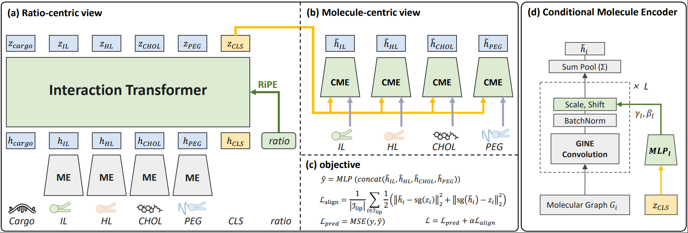

# STRATA

Screening Lipid Nanoparticles through Structure-Ratio Alignment

[](https://www.biorxiv.org/content/10.64898/2026.07.08.737142v2) [](https://neurips.cc) [](https://www.python.org) [](https://pytorch.org) [](https://pyg.org) [](https://docs.astral.sh/uv/) [](https://github.com/Yoonho-Lee-AI4Science/STRATA)

[Overview](#overview) | [Installation](#installation-with-uv) | [Data](#data) | [Quick start](#quick-start) | [Arguments](#arguments) | [Evaluation splits](#evaluation-splits) | [Outputs](#outputs) | [Citation](#citation)

---

## Overview

This is the official implementation of **STRATA** (NeurIPS 2026). STRATA predicts the transfection efficiency of a lipid nanoparticle (LNP) formulation.

An LNP is a mixture of four lipids, an **ionizable lipid (IL)**, a **helper lipid (HL)**, **cholesterol (CHOL)** and a **PEG-lipid (PEG)**, plus a nucleic-acid **cargo**. How well it delivers depends on two things: *which* molecules are used and *in what ratios* they are mixed. Most earlier models learn a good embedding for each molecule on its own. STRATA models how the components **interact** with each other, and how those interactions change with the composition ratio.

[](./img/model_architecture.PNG)

_(a) A ratio-centric Interaction Transformer reads per-molecule embeddings and encodes composition ratios through RiPE. (b) A molecule-centric view re-encodes each molecule with a Conditional Molecule Encoder (CME) conditioned on the interaction summary `z_CLS`. (c) The two views are trained jointly and aligned. (d) Each CME layer is a GINE convolution with a FiLM-style scale and shift computed from `z_CLS`._

### Highlights

- **Two complementary views**: a *ratio-centric* view captures interactions caused by the composition ratios, and a *molecule-centric* view adds those effects back into structure-based molecule embeddings.
- **RiPE (Ratio-induced Positional Embedding)**: a rotary embedding that uses `log(ratio)` as the position. Attention therefore depends on ratio *quotients*, which match the multiplicative nature of composition, rather than on ratio *differences*.
- **Structure-ratio alignment**: a symmetric stop-gradient loss keeps the two views consistent: `L = L_pred + α · L_align`.
- **Generalization tests**: built-in splits for unseen molecules and for unseen IL, HL, CHOL, PEG and IL-to-cargo ratios.

### How the paper maps to the code

| Paper component | Code | File |
|---|---|---|
| STRATA (full model) | `interaction_transformer` | [`src/agile_finetune.py`](src/agile_finetune.py) |
| Molecule Encoder (ME), frozen | `interaction_transformer.molecule_encoder` | [`src/agile_finetune.py`](src/agile_finetune.py) |
| Conditional Molecule Encoder (CME) | `Conditional_AGILE` (with a `condition` input) | [`src/agile_finetune.py`](src/agile_finetune.py) |
| RiPE / RoPE / APE / random PE | `--pos_enc RiPE / RoPE / abs / rand` | [`src/agile_finetune.py`](src/agile_finetune.py) |
| GBF ratio encoding (ablation) | separate model variant | [`src/agile_finetune_comet_pos.py`](src/agile_finetune_comet_pos.py) |
| Alignment loss `L_align`, weight α | `_consistency_loss`, `--consistency` | [`src/train.py`](src/train.py) |

> [!NOTE]
> In the code, the STRATA model is called **`interaction_transformer`**. It is the only value accepted by `--model`.

## Installation with uv

We manage the Python environment with [**uv**](https://docs.astral.sh/uv/), a fast drop-in replacement for `pip` and `venv`.

### Step 0. Install uv

Skip this step if `uv --version` already works.

```bash
curl -LsSf https://astral.sh/uv/install.sh | sh
# or: pip install uv
```

### Step 1. Clone the repository with Git LFS

The preprocessed dataset (`dataset/preprocessed.tar.gz`, about 785 MB) is stored with [Git LFS](https://git-lfs.com). Install Git LFS **before** cloning so the real file is downloaded:

```bash
git lfs install
git clone https://github.com/Yoonho-Lee-AI4Science/STRATA.git
cd STRATA
```

### Step 2. Create the uv environment

Run these four commands in the repository root (`STRATA/`):

```bash
uv init --python 3.9
uv run python          # Execute python (for initialization purpose), and then close it.
uv pip install deepchem[torch]
uv pip install torch_geometric tqdm pdbpp wandb
```

> [!WARNING]
> - **Conda users:** if a conda environment is active, `uv pip install` installs into *that* environment instead of `.venv/`. Run `conda deactivate` first, until no environment (not even `base`) is active.
> - **zsh users:** zsh treats `[ ]` as a glob pattern. Write the third command as `uv pip install "deepchem[torch]"`.

### Step 3. (Optional) Check the installation

```bash
uv run python -c "import torch, torch_geometric, rdkit; print('torch', torch.__version__, '| PyG', torch_geometric.__version__, '| CUDA', torch.cuda.is_available())"
```

If `CUDA` prints `False` on a GPU machine, the default PyTorch wheel probably doesn't match your CUDA driver. Install a matching wheel from [pytorch.org](https://pytorch.org/get-started/locally/) with `uv pip install torch --index-url <url>`.

<details>
<summary><b>Tested environment</b> (after both the main setup and the <code>dataset/</code> setup)</summary>

| Package | Version |
|---|---|
| Python | 3.9.25 |
| torch | 2.8.0 |
| torch-geometric | 2.6.1 |
| deepchem | 2.8.0 |
| rdkit | 2025.9.2 |
| numpy | 1.23.4 |
| pandas | 1.5.2 |
| scikit-learn | 1.2.0 |
| wandb | 0.26.1 |

</details>

> [!TIP]
> To **re-run the dataset preprocessing** yourself, you need one more uv setup inside `dataset/`. See [`dataset/README.md`](dataset/README.md#b-1-environment-setup-uv). To use the preprocessed splits we provide, Steps 0–2 are all you need.

## Data

### Get the data (one command)

```bash
cd dataset
tar -zxvf preprocessed.tar.gz      # creates a549/, yz22/, LC24*/ inside dataset/
cd ..
```

That's it. To rebuild the splits from the raw CSV files, or to learn how the folders are organized, see **[`dataset/README.md`](dataset/README.md)**.

### Available datasets

| Dataset | `--dataset_name` | What varies | # LNPs | Random split (train / valid / test) |
|---|---|---|---|---|
| A549 | `a549` | 192 ILs, 3 HLs, ratios | 1,801 | 1,080 / 360 / 361 |
| YZ22 | `yz22` | 1 IL, 6 HLs, ratios | 1,080 | 540 / 180 / 180 |
| LC24 – HEK293 | `LC24HEK293` | 1 IL, 6 HLs, ratios | 1,080 | 540 / 180 / 180 |
| LC24 – N2a | `LC24N2a` | 1 IL, 4 HLs, ratios | 720 | 360 / 120 / 120 |
| LC24 – ARPE19 | `LC24ARPE19` | 1 IL, 4 HLs, ratios | 720 | 360 / 120 / 120 |
| LC24 – B16 | `LC24B16` | 1 IL, 6 HLs, ratios | 1,080 | 540 / 180 / 180 |
| LC24 – PC3 | `LC24PC3` | 1 IL, 6 HLs, ratios | 1,080 | 540 / 180 / 180 |

Every dataset comes with 20 pre-generated random seeds (`split_0` … `split_19`). By default, training uses the first 10 (`--num_splits 10`). `--dataset_name` is **case-sensitive**.

### Pretrained molecular encoder

`checkpoints/MolCLR/model.pth` is the pretrained AGILE-style GNN backbone (GINE layers, MolCLR-style contrastive pretraining; see `config.yaml`). It ships with the repository and is loaded automatically into both the ME and the CME at the start of every split. The ME stays **frozen** and the CME is **fine-tuned**.

## Quick start

All training scripts are run from the `src/` folder.

### STRATA with RiPE, the main model (`train_model.py`)

```bash
cd src
uv run train_model.py \
    --dataset_name a549 \
    --pos_enc RiPE \
    --lr 1e-4 \
    --consistency 1.0 \
    --hidden 512 \
    --heads 8 \
    --wd 0.01 \
    --num_splits 10 \
    --device 0
```

Use the same script for the positional-encoding ablations. Only `--pos_enc` changes:

```bash
uv run train_model.py --dataset_name a549 --pos_enc RoPE --device 0   # rotary, raw ratio as position
uv run train_model.py --dataset_name a549 --pos_enc abs  --device 0   # absolute (sinusoidal) PE, "APE"
uv run train_model.py --dataset_name a549 --pos_enc rand --device 0   # learnable per-component embedding
```

### STRATA with GBF ratio encoding (`train_model_comet_pos.py`)

```bash
cd src
uv run train_model_comet_pos.py \
    --dataset_name a549 \
    --lr 1e-4 \
    --consistency 1.0 \
    --hidden 512 \
    --heads 8 \
    --wd 0.01 \
    --num_splits 10 \
    --device 0
```

### Out-of-distribution splits

Add **one** split flag to any command above (see [Evaluation splits](#evaluation-splits)):

```bash
uv run train_model.py --dataset_name yz22 --unseen_HLs        --device 0   # unseen helper lipids
uv run train_model.py --dataset_name a549 --unseen_split_CARs --device 0   # unseen IL-to-cargo ratios
```

> [!IMPORTANT]
> - The values above are the **code defaults**, given so you can try the pipeline end to end. The hyperparameter search space used in the paper is listed in the paper's appendix.
> - Keep **`--wd 0.01`** and **`--num_splits 10`** fixed to reproduce the paper setting.
> - **`--device` defaults to `6`.** Always set it to the GPU index you actually want to use, for example `--device 0`.

## Arguments

### Common to both scripts

| Argument | Default | Description |
|---|---|---|
| `--dataset_name` | `a549` | Dataset to train on (see [Available datasets](#available-datasets)). |
| `--device` | `6` | CUDA device index, for example `0`. |
| `--lr` | `1e-4` | Learning rate (AdamW). |
| `--wd` | `0.01` | Weight decay. Keep it at `0.01`. |
| `--hidden` | `512` | Hidden dimension of the transformer and of the molecule embeddings. |
| `--heads` | `8` | Number of attention heads. |
| `--num_layers` | `4` | Number of transformer layers. This also sets the number of GINE layers in the ME and CME. |
| `--consistency` | `1.0` | α, the weight of the alignment loss `L_align`. `0` turns alignment off. |
| `--drop` | `0.3` | Dropout ratio. |
| `--batch_size` | `50` | Batch size. |
| `--epochs` | `500` | Maximum number of epochs per split. |
| `--patience` | `500` / `-1` | Early-stopping patience in epochs (`train_model.py` / `train_model_comet_pos.py`). `≤ 0` disables it. |
| `--num_splits` | `10` | Trains on `split_0` … `split_{n-1}` and reports the mean ± std. |
| `--wandb_name` | `""` | [W&B](https://wandb.ai) project name. Leave it empty to turn logging off. |
| `--unseen_*` | off | OOD split flags (see [Evaluation splits](#evaluation-splits)). |

### Only in `train_model.py`

| Argument | Default | Description |
|---|---|---|
| `--pos_enc` | `RiPE` | How ratios enter the transformer: `RiPE`, `RoPE`, `abs`, `rand`, `None`. |
| `--split_i` | `-1` | Run only this one split index. `-1` runs all of them. |
| `--time` | off | Only measure the time per training epoch (nothing is saved). |

### Only in `train_model_comet_pos.py`

| Argument | Default | Description |
|---|---|---|
| `--percent_embed_dim` | `128` | Dimension of the Gaussian-basis (GBF) ratio features. |
| `--component_types_embed_dim` | `128` | Dimension of the component-type embedding. |
| `--activation_fn` | `gelu` | Activation in the ratio-aware token projection. |

### Positional-encoding options at a glance

| Option | Name in the paper | How the composition ratio is used |
|---|---|---|
| `--pos_enc RiPE` | **RiPE (ours)** | Rotary embedding with `log(ratio)` as position, so attention depends on ratio *quotients*. |
| `--pos_enc RoPE` | RoPE | Rotary embedding with the raw ratio as position, so attention depends on ratio *differences*. |
| `--pos_enc abs` | APE | Sinusoidal embedding of the ratio, added to each token. |
| `--pos_enc rand` | Random | A learnable embedding per component slot. Ratios are not encoded. |
| `train_model_comet_pos.py` | GBF | Ratio expanded with Gaussian basis functions and concatenated to the molecule embedding (COMET-style). |

## Evaluation splits

Pass **at most one** of these flags. Without any flag you get the random (in-distribution) split. The same flags are used for preprocessing and for training. They select the folder `<FORM>_form_screen<suffix>`.

| Split | Flag | Folder suffix | What the test set contains | Available for |
|---|---|---|---|---|
| Random | *(none)* | — | Same distribution as the training set | all |
| Unseen IL molecules | `--unseen_ILs` | `_usIL` | Ionizable lipids never seen in training | `a549` |
| Unseen HL molecules | `--unseen_HLs` | `_usHL` | Helper lipids never seen in training | `yz22`, `LC24*` |
| Unseen IL ratio | `--unseen_split_ILs` | `_usILratio` | IL molar ratios outside the training range | all |
| Unseen HL ratio | `--unseen_split_HLs` | `_usHLratio` | HL molar ratios outside the training range | all |
| Unseen CHOL ratio | `--unseen_split_CHOLs` | `_usCHOLratio` | CHOL molar ratios outside the training range | all |
| Unseen PEG ratio | `--unseen_split_PEGs` | `_usPEGratio` | PEG molar ratios outside the training range | all |
| Unseen IL-to-cargo ratio | `--unseen_split_CARs` | `_usCARratio` | IL-to-cargo ratios outside the training range (1 : 1 : 1 split) | all |

## Outputs

Results are written under the repository root:

```
results/<dataset_dir>/<FORM>_form_screen<suffix>/0.6_0.2_0.2/<config_string>/
└── split_<i>/
    ├── model.pth     # best checkpoint (lowest validation MSE)
    └── result.txt    # test set: line 1 = LNP ids, line 2 = true labels, line 3 = predictions
```

`<config_string>` joins all hyperparameter values with `_`, so different runs never overwrite each other. The console prints the test MSE and RMSE for every split, and then a final summary:

```
<config_string> || test_mse mean: 0.xxxxxx, std: 0.xxxxxx
```

## Repository layout

```
STRATA/
├── src/
│   ├── train_model.py              # entry point: STRATA with RiPE / RoPE / APE / random PE
│   ├── train_model_comet_pos.py    # entry point: STRATA with GBF ratio encoding
│   ├── train.py                    # training & evaluation loop for train_model.py
│   ├── train_comet_pos.py          # training & evaluation loop for train_model_comet_pos.py
│   ├── agile_finetune.py           # STRATA model: Interaction Transformer, ME/CME, RiPE
│   ├── agile_finetune_comet_pos.py # STRATA model variant with GBF ratio encoding
│   └── multimol_dataset.py         # TSV -> (4 molecular graphs, ratios, label)
├── dataset/
│   ├── README.md                   # dataset guide (preprocessed data & preprocessing)
│   ├── preprocessed.tar.gz         # ready-to-use splits (Git LFS)
│   ├── preprocess_a549_default.py      # builds A549 splits
│   ├── preprocess_yz22_default.py      # builds YZ22 splits
│   └── preprocess_selective_default.py # builds LC24 splits (one cell line per run)
├── experiments/data_json/          # raw CSV files used by the preprocessing scripts
├── checkpoints/MolCLR/             # pretrained molecular encoder (model.pth, config.yaml)
├── img/model_architecture.PNG
└── README.md
```

## Troubleshooting

| Symptom | Fix |
|---|---|
| `uv pip install` succeeds, but `uv run` can't find the package | A conda environment is active. Run `conda deactivate` and reinstall (see [Step 2](#step-2-create-the-uv-environment)). |
| `tar: This does not look like a tar archive` | You downloaded the Git LFS pointer, not the real file. Run `git lfs install && git lfs pull`. |
| `FileNotFoundError: .../train.tsv` | The data isn't extracted, `--dataset_name` has the wrong case (e.g. `lc24n2a`), or the split flag isn't available for that dataset (e.g. `--unseen_ILs` with `yz22`). |
| `CUDA error: invalid device ordinal` | `--device` defaults to `6`. Set it to a GPU you have, for example `--device 0`. |
| `Pretrained checkpoint not found` | `checkpoints/MolCLR/model.pth` is missing. Training still runs, but the encoders start from random weights. |

## Citation

If you find STRATA useful, please cite:

```bibtex
@article{lee2026strata,
  title   = {Screening Lipid Nanoparticles through Structure-Ratio Alignment},
  author  = {Lee, Yoonho and Oh, Yunhak and Choi, Hoyoung and Park, Chanyoung},
  journal = {bioRxiv},
  year    = {2026},
  doi     = {10.64898/2026.07.08.737142}
}
```

## Acknowledgements

Parts of this codebase build on [AGILE](https://github.com/bowang-lab/AGILE) (molecular graph featurization and GNN encoder), [MolCLR](https://github.com/yuyangw/MolCLR) (encoder pretraining) and [COMET](https://github.com/alvinchangw/COMET) (data preprocessing pipeline and GBF ratio encoding). We thank the authors for releasing their code.

---

**From lipid structures and their mixing ratios to transfection efficiency, in one aligned model.**
